## Прямі посилання на об'єкти (Direct Object References)

**Прямі посилання на об'єкти** — це ситуація, коли додаток використовує вхідні дані, надані клієнтом, для доступу до даних та об'єктів.

## Спочатку автентифікація, потім — зловживання авторизацією
Багато проблем контролю доступу вразливі до атак з боку автентифікованого, але неавторизованого користувача. Тож почнемо з легітимної автентифікації. Після цього ми шукатимемо способи обійти авторизацію або зловжити нею.

**Логін** та **пароль** для цього облікового запису — `tom` та `cat`.

Після проходження автентифікації переходимо до наступного екрану.

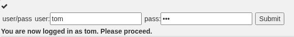

## **Спостереження відмінностей і поведінки**

Послідовний принцип з наступальної сторони AppSec полягає в тому, щоб звертати увагу на відмінності між «сирою» (raw) відповіддю сервера і тим, що фактично відображається користувачу. Іншими словами (як ви, можливо, вже помітили в уроці про фільтрацію на стороні клієнта), у «сирій» відповіді часто містяться дані, які не відображаються на екрані/сторінці. Перегляньте профіль нижче та зверніть увагу на ці відмінності.

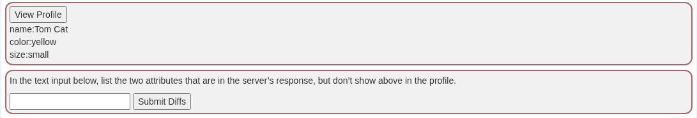

Переглядаємо  httphistory у burpsuit та знаходимо відмінності:

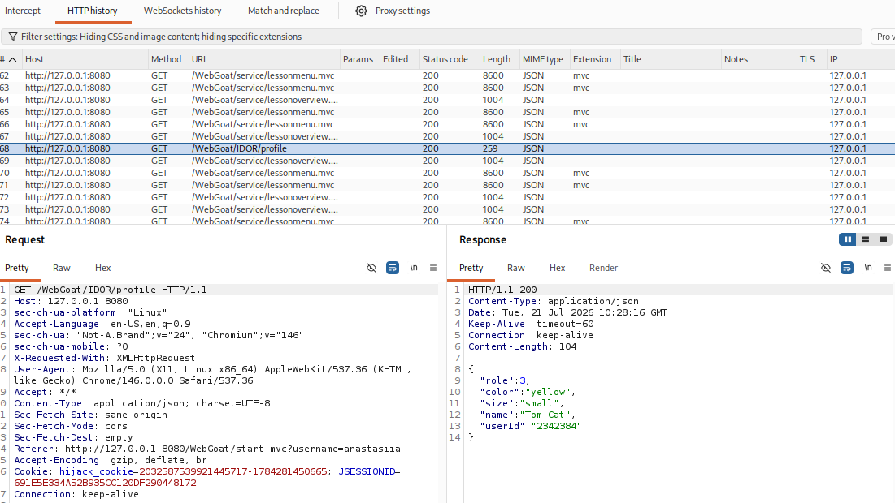

Як результат - цей крок пройдено:

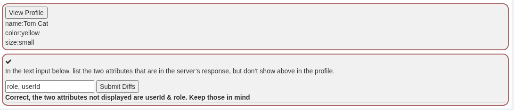

## **Вгадування та передбачення шаблонів**

**Перегляньте свій профіль іншим способом**

Здається, застосунок, з яким ми працюємо, дотримується RESTful-підходу щодо профілів. У багатьох застосунках існують ролі, за яких користувач із підвищеними правами може переглядати контент інших користувачів. У такому випадку просто шлях `/profile` не спрацює, оскільки дані сесії/автентифікації користувача не вказують, чий саме профіль потрібно відобразити.

Шаблон, який найімовірніше використовується для явного перегляду власного профілю через пряме посилання на об’єкт (direct object reference):

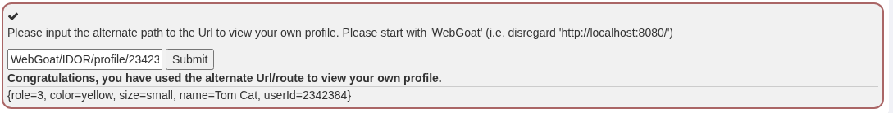

## Гра з шаблонами (Playing with the Patterns)

### Перегляд іншого профілю
Перегляньте профіль іншого користувача, скориставшись тим самим альтернативним шляхом, який ви вже використовували для перегляду власного профілю. Скористайтеся кнопкою **"View Profile"** (Переглянути профіль), перехопіть та модифікуйте запит, щоб побачити дані іншої особи. Крім того, ви можете спробувати просто надіслати ручний **GET-запит** через браузер.

Для цього потрібно знайти відпоівдний запит, та модифікувати його в "Intruder":

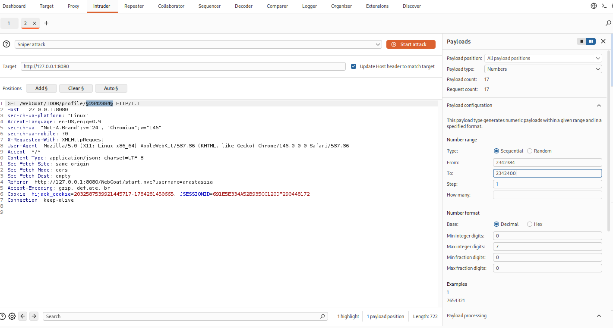

Після запуску атаки отримуємо підказку, що ми на вірному шляху:

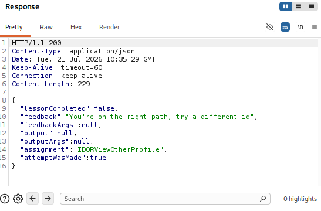

Фінальні результати:

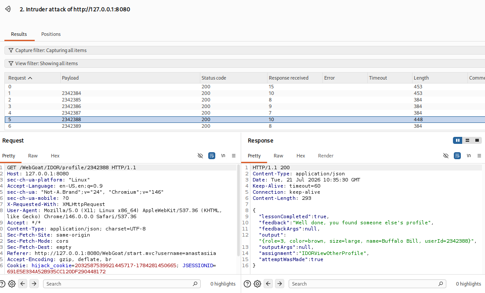

### Редагування іншого профілю
Старіші додатки можуть працювати за іншими принципами, але **RESTful-додатки** (як у цьому випадку) часто просто змінюють HTTP-методи (з додаванням тіла запиту або без нього) для виконання різних функцій.

Використовуйте ці знання, щоб взяти той самий базовий запит і змінити його **метод (method)**, **шлях (path)** та **тіло (body/payload)**, щоб відредагувати профіль іншого користувача (Buffalo Bill).
* Змініть роль на нижчу (оскільки ролі та користувачі з вищими привілеями зазвичай мають менші порядкові номери).
* Також змініть колір користувача на **"red"** (червоний).

Для вирішення цього питання потрібно мати актуальний (час обмежений) **JSESSIONID**. Далі з "свіжого" успішного запиту **GET** зробити в **Repater** запит **PUT**. Детально запит представлений на наступному скріншоті.

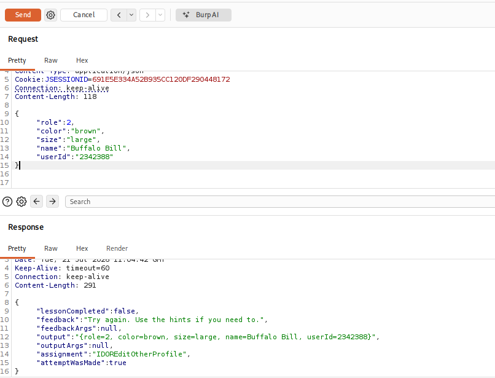

Змінюємо колір користувача на **"red"** та отримуємо повідомлення з підказкою зменшити роль (2->1):

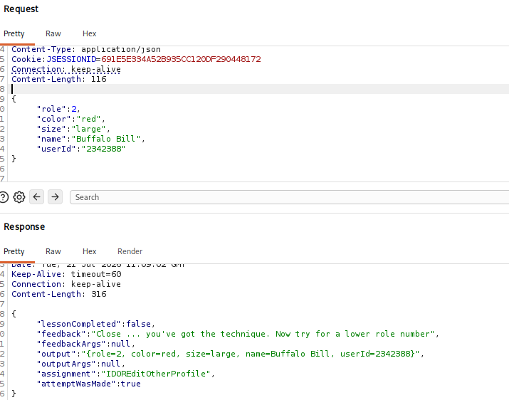

Після внесення змін отримуємо результат:

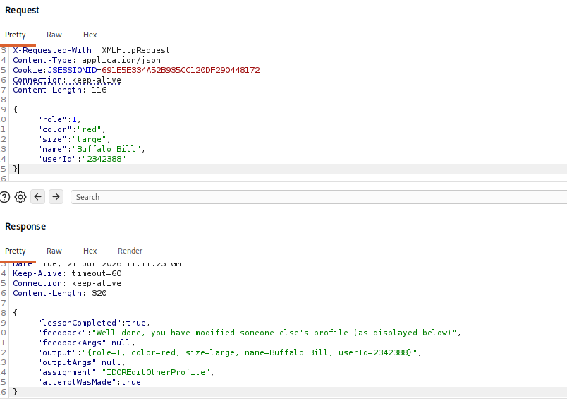

Відповідно в завданні вкладинка змінює колір з червоного на зелений:

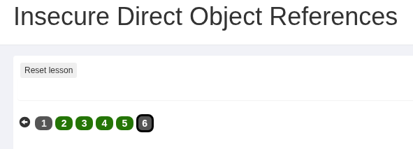

Вітання, завдання пройдено!
